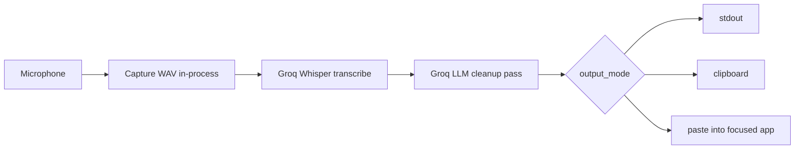

<div align="center">


<h1>flowstate</h1>

<p><strong>Think out loud. Ship in text.</strong></p>

<p>A keyboard-free way to think. flowstate captures your voice, cleans it with an LLM,<br/>
and drops perfect text into any app — from your terminal, on Mac, Linux, and Windows.</p>

<p>
  <a href="https://github.com/mazen160/flowstate/actions/workflows/ci.yml"></a>
  <a href="https://github.com/mazen160/flowstate/releases"></a>
  <a href="https://golang.org/dl/"></a>
  <a href="LICENSE"></a>
  
  <a href="https://console.groq.com"></a>
</p>

<p>
  <a href="#install">Install</a> ·
  <a href="#quickstart">Quickstart</a> ·
  <a href="#recipes">Recipes</a> ·
  <a href="#how-it-compares">Compare</a> ·
  <a href="https://github.com/mazen160/flowstate/discussions">Discussions</a>
</p>

</div>

---

## See it think

<div align="center">
  
  <br/>
  <sub>If your viewer doesn't animate SVGs, see <a href="assets/demo.png"><code>demo.png</code></a>.</sub>
</div>

A real session, end-to-end:

```text
$ flowstate
● Recording ▁▂▄█▆▃▁ — press Enter to stop
[you speak: "hey um so just wanted to follow up on the meating from yesterday i
 think we should definately move the deadline to next friday"]
[Enter]
● Transcribing…
● Cleaning up…
✓ Done. (94 characters, 1.8s)

Hey, just following up on the meeting from yesterday. I think we should
definitely move the deadline to next Friday.
```

The cleaned text lands on stdout AND your clipboard. Status (the `●` / `✓` lines) goes to stderr — pipe-safe by default.

## Why flowstate

<table>
<tr>
<td width="33%" valign="top">

### Speak.
Press Enter or hold a key. A live mic meter shows you it's listening. No menubar app, no popup window, no hotkey daemon to install — just a terminal that listens.

</td>
<td width="33%" valign="top">

### Clean.
Filler words gone. Punctuation right. Self-corrections honored. Domain spellings preserved. Powered by Groq's Whisper for transcription and an LLM cleanup pass that knows the difference between prose and code.

</td>
<td width="33%" valign="top">

### Ship.
Print to stdout. Copy to clipboard. Paste into the focused app. Or all three. Pipe it into `jq`, `gh issue create`, `tee -a journal.md` — flowstate is a CLI citizen, not an island.

</td>
</tr>
</table>



## Status

Alpha. The binary builds and the unit + smoke tests pass on macOS, Linux, and Windows, but the audio capture and paste-as-keystrokes paths have only been hand-exercised on a small number of hosts. Expect rough edges, especially around microphone selection and paste timing. Bug reports and PRs welcome — see [Contributing](#contributing).

## Install

The fastest path on every platform:

```sh
go install github.com/mazin-ahmed/flowstate/cmd/flowstate@latest
```

flowstate is cgo-enabled (audio capture and keyboard hooks need it), so you'll need a working C toolchain. Pick your OS for the exact prerequisites:

<details>
<summary><b>macOS</b></summary>

Install Xcode command-line tools, then `go install`:

```sh
xcode-select --install
go install github.com/mazin-ahmed/flowstate/cmd/flowstate@latest
```

The first time you use `paste` or `push-to-talk`, the OS will prompt you to add Accessibility permission for the terminal application running flowstate (Terminal, iTerm2, etc.) under **System Settings → Privacy & Security → Accessibility**.

If you downloaded a release archive instead of building, macOS Gatekeeper will quarantine the binary. Strip the attribute once:

```sh
xattr -d com.apple.quarantine ./flowstate
```

</details>

<details>
<summary><b>Linux</b></summary>

On Debian/Ubuntu-based distributions:

```sh
sudo apt-get update
sudo apt-get install -y \
    libasound2-dev \
    libx11-dev libxkbcommon-dev libxtst-dev libxinerama-dev libxrandr-dev \
    pulseaudio-utils alsa-utils
go install github.com/mazin-ahmed/flowstate/cmd/flowstate@latest
```

For `output_mode = paste` on Wayland, install `wtype`. On X11, `xdotool` is the fallback.

</details>

<details>
<summary><b>Windows</b></summary>

Install Go (which ships with a working C toolchain), then:

```powershell
go install github.com/mazin-ahmed/flowstate/cmd/flowstate@latest
```

Audio capture (WASAPI), `mute_while_recording`, paste (`SendInput`), and push-to-talk all work without extra permissions.

</details>

<details>
<summary><b>From a release archive</b></summary>

Download the matching archive from [Releases](https://github.com/mazen160/flowstate/releases), extract, and put the binary on your `$PATH`:

```sh
# Linux / macOS
tar -xzf flowstate_vX.Y.Z_<os>_<arch>.tar.gz
mv flowstate /usr/local/bin/
```

```powershell
# Windows
Expand-Archive flowstate_vX.Y.Z_windows_amd64.zip
```

Each release archive ships with a per-platform SHA-256 checksum file (`.sha256`) for verification.

</details>

## Quickstart

```sh
flowstate config init                 # write default config
export GROQ_API_KEY=gsk_...           # get one from https://console.groq.com
flowstate                             # speak, then press Enter when you're done
```

That's the whole loop. The cleaned text prints to stdout and lands on your clipboard.

## Recipes

### Send a Slack message

```sh
flowstate --output paste --paste-delay 3
```

Speak, press Enter (or wait for max-time), then switch to Slack within 3 seconds — flowstate types the cleaned text where your cursor is.

<div align="center">
  
</div>

### Push-to-talk

Edit the config: `trigger = "push-to-talk"`, `ptt_key = "space"`. Then run `flowstate` — recording starts when you hold space and stops when you release. Requires Accessibility permission on macOS.

<div align="center">
  
</div>

### Save a transcript to a file

```sh
flowstate --output stdout > note.md
```

Stdout is just the text. Status lines (Recording…/Done.) go to stderr.

### One-shot, no keypress

```sh
flowstate --max-time 10
```

Auto-stops after 10 seconds. Same pipeline; exits 0.

### Translate as you dictate

Set `output_language = "French"` in `~/.config/flowstate/config.toml`, then run `flowstate` and speak in English. The cleanup pass translates the result.

### Pipe into a tool

```sh
flowstate --output stdout | gh issue create --title "voice note" --body -
flowstate --output stdout | tee -a journal.md
flowstate --output stdout | mail -s "voice memo" you@example.com
```

### Pick a non-default microphone

```sh
flowstate devices            # list inputs
flowstate --device '4275696c74496e4d6963726f70686f6e65446576696365'
```

### Disable colors / quiet mode

```sh
flowstate --no-color           # plain stderr, no ANSI
NO_COLOR=1 flowstate           # same, shell-wide
flowstate 2>/dev/null          # suppress all status; transcript only
```

## How it compares

|                          | **flowstate**                | Wispr Flow              | Superwhisper          | whisper.cpp                |
|--------------------------|------------------------------|--------------------------|-----------------------|----------------------------|
| Mac / Linux / Windows    | Yes                          | Mac / Win / mobile       | Mac only              | Mac / Linux / Windows      |
| Terminal-native CLI      | Yes — pipe-friendly          | No (menu-bar app)        | No (menu-bar app)     | Yes — but lower-level      |
| LLM cleanup pass         | Yes — Groq                   | Yes — proprietary        | Yes — proprietary     | No (raw transcription)     |
| BYO API key              | Yes — Groq                   | Subscription             | One-time license      | n/a (local)                |
| Network required         | Yes — Groq API               | Yes                      | No (local)            | No (local)                 |
| Cost                     | Free + Groq API usage        | Subscription             | One-time license      | Free                       |
| Best for                 | Devs who live in the terminal| Knowledge workers        | Privacy-first dictators| Hackers and researchers   |

flowstate is the one that's all of: cross-platform, terminal-native, LLM-cleaned, BYO key, and free. Pick whichever matches how you work.

## Configuration

<details>
<summary><b>Where the config lives</b></summary>

Configuration lives in TOML at the path printed by `flowstate config path`.
Resolution order: `--config <path>` > `$FLOWSTATE_CONFIG` > the platform default
(`~/.config/flowstate/config.toml` on macOS/Linux or `%APPDATA%\flowstate\config.toml`
on Windows).

The Groq API key is **not** a config field. It is read from the `GROQ_API_KEY`
environment variable (or `GROQ_API_TOKEN` as a fallback) at runtime. Any
subcommand that calls Groq will fail with a friendly message naming both env
vars if neither is set.

</details>

<details>
<summary><b>All flags (record mode)</b></summary>

| Flag | Default | Effect |
|---|---|---|
| `--config <path>` | platform default | Override config file path. |
| `--prompt <name>` | `default` | Switch active cleanup prompt (`default` / `command` / `literal`). |
| `--output <list>` | `stdout,clipboard` | Comma list of `stdout` / `clipboard` / `paste`, or `all`. |
| `--no-mute` | (mute on) | Disable mute_while_recording for this run. |
| `--device <uid>` | system default | Pick a specific microphone. List via `flowstate devices`. |
| `--trigger <mode>` | `enter` | `enter` or `push-to-talk`. |
| `--ptt-key <name>` | `space` | Key held in push-to-talk mode. |
| `--model <name>` | `openai/gpt-oss-20b` | Override cleanup model. |
| `--no-color` | (auto) | Disable ANSI colors on stderr. |
| `--max-time <secs>` | `0` | Auto-stop recording after N seconds and process. |
| `--paste-delay <secs>` | `0` | Wait N seconds between clipboard seed and paste keystroke. |

All flags override the matching config field for one invocation only. Unset flags leave the on-disk config untouched.

</details>

<details>
<summary><b>All config fields</b></summary>

| Field                    | Default                                    | Meaning                                                                              |
| ------------------------ | ------------------------------------------ | ------------------------------------------------------------------------------------ |
| `trigger`                | `"enter"`                                  | How recording stops: `enter` (press Enter) or `push-to-talk` (hold a key).           |
| `ptt_key`                | `"space"`                                  | Key held in push-to-talk mode. Ignored when `trigger = "enter"`.                     |
| `base_url`               | `"https://api.groq.com/openai/v1"`         | Provider root. Override only for a self-hosted OpenAI-compatible proxy.              |
| `transcription_model`    | `"whisper-large-v3"`                       | Whisper model id passed to `/audio/transcriptions`.                                  |
| `cleanup_model`          | `"openai/gpt-oss-20b"`                     | LLM model id passed to `/chat/completions` for cleanup.                              |
| `cleanup_fallback_model` | `"meta-llama/llama-4-scout-17b-16e-instruct"` | Retried on HTTP 429 or empty primary response. Set equal to `cleanup_model` (or empty) to disable. |
| `language`               | `"en"`                                     | ISO-639-1 language hint. Set `""` to auto-detect, or `"fr"`/`"es"`/`"de"`/etc.       |
| `output_language`        | `""`                                       | Translation target for the cleanup pass. Empty = same as spoken. Non-empty adds an "Output ONLY in `<lang>`" directive to the cleanup system prompt. |
| `input_device`           | `""`                                       | Microphone UID or name. Empty = system default. List with `flowstate devices`.       |
| `mute_while_recording`   | `true`                                     | Mutes system audio output during the recording so playback doesn't bleed in.         |
| `output_mode`            | `"stdout,clipboard"`                       | Comma list of `stdout`, `clipboard`, `paste`, or the literal `"all"`.                |
| `preserve_clipboard_after_paste` | `true`                              | When `paste` is enabled, snapshot the current clipboard before pasting and restore it ~500ms later, unless you copied something else in the meantime. |
| `active_prompt`          | `"default"`                                | Which key under `[prompts]` to use as the system prompt for cleanup.                 |
| `custom_vocabulary`      | `""`                                       | Comma/newline/semicolon-separated terms preserved as high-priority spellings during cleanup. Multiline TOML strings are supported. |
| `colors`                 | `"auto"`                                   | Status-line colors: `"auto"` (TTY-detect), `"always"` (force on), `"never"` (force off). `--no-color` and `NO_COLOR=1` also disable. |
| `max_time_seconds`       | `0`                                        | Auto-stop recording after N seconds and process normally (exit 0). `0` disables (manual stop only). Override with `--max-time <seconds>`. |
| `paste_delay_seconds`    | `0`                                        | When `paste` is enabled, wait N seconds between writing the clipboard and firing the paste keystroke. Gives you time to focus the destination window. Override with `--paste-delay <seconds>`. |
| `[prompts]`              | three embedded prompts                     | Table of named cleanup prompts. See **Prompts** below.                               |

</details>

<details>
<summary><b>Prompts (default / command / literal)</b></summary>

`[prompts]` is a table of named system prompts. flowstate ships three by default:

- **`default`** — full FreeFlow-style cleanup. Removes filler words, fixes spelling and punctuation, preserves the speaker's intent, and is aware of developer syntax (code blocks, command names) so technical dictation doesn't get auto-corrected to gibberish.
- **`command`** — transform a highlighted piece of text per a spoken instruction (e.g. "make this shorter"). Reserved for a future edit-mode subcommand; currently ignored unless explicitly selected.
- **`literal`** — minimal cleanup, no context-awareness. Use this if the default prompt is rewriting more than you want.

Switch prompts per-run with `--prompt <name>`, or change `active_prompt` in the config to make it sticky. Prompt bodies are embedded into the default config at `flowstate config init` time, so you can edit them in place; re-init won't clobber your changes (use `--force` to overwrite).

</details>

<details>
<summary><b>Trigger modes</b></summary>

### `enter` (default)

Capture starts as soon as `flowstate` is invoked and stops when you press Enter. Works on every host without extra permissions.

### `push-to-talk`

Capture starts when you press and hold `ptt_key`, and stops when you release it. The transcription + cleanup pipeline runs on release.

PTT uses a global keyboard hook (so the key works regardless of which window has focus), which requires extra permissions:

- **macOS** — Accessibility permission for the terminal application, granted in **System Settings → Privacy & Security → Accessibility**. The first attempted use will prompt you.
- **Linux** — usually works out of the box on X11; Wayland support depends on the compositor.
- **Windows** — works out of the box.

</details>

<details>
<summary><b>Output modes (stdout / clipboard / paste / all)</b></summary>

`output_mode` is a comma-separated list of destinations:

- `stdout` — print the cleaned text to standard output, followed by a newline. Status (`Done. (N characters)`) goes to stderr, so stdout stays pipeable.
- `clipboard` — copy the cleaned text to the system clipboard.
- `paste` — simulate `Cmd+V` (macOS) or `Ctrl+V` (Linux/Windows) into the currently focused application.

The literal value `all` is shorthand for `stdout,clipboard,paste`. Order doesn't matter; flowstate always writes to all selected destinations.

</details>

<details>
<summary><b>Status output and colors</b></summary>

While a recording is in flight, flowstate prints staged status lines to **stderr**:

- `● Recording — press Enter to stop` with a small live audio-level meter while you speak.
- `● Transcribing…` once the upload starts.
- `● Cleaning up…` while the LLM rewrite runs.
- `✓ Done. (N characters, 2.3s)` at the end.

Errors and soft warnings (mute failure, "no speech detected", config typos) also go to stderr, prefixed with `✗` or `⚠`. **Nothing other than the cleaned transcript is ever written to stdout**, so `flowstate | jq` and similar pipelines stay clean.

Disable colors with `--no-color`, `NO_COLOR=1`, or `colors = "never"` in the config. Force on with `colors = "always"`. Default is `"auto"` (TTY-detect).

</details>

<details>
<summary><b>Subcommands</b></summary>

- `flowstate` — record. The default command.
- `flowstate version` — print the build identifier and Go runtime version.
- `flowstate config init [--force] [--config <path>]` — write the default config to the resolved path. `--force` overwrites an existing file.
- `flowstate config path [--config <path>]` — print the resolved config path to stdout.
- `flowstate devices` — list input devices as `<UID>\t<Name>`. Useful for filling in `input_device`. Exits 1 with "no input devices found" on a headless host.

</details>

<details>
<summary><b>Per-platform prerequisites (full table)</b></summary>

| Feature                | macOS                              | Linux                                   | Windows                |
| ---------------------- | ---------------------------------- | --------------------------------------- | ---------------------- |
| Audio capture          | built-in                           | built-in (PulseAudio / PipeWire)        | built-in (WASAPI)      |
| `mute_while_recording` | `osascript` (built-in)             | `pactl` (PulseAudio) or `amixer` (ALSA) | built-in (Core Audio)  |
| `output_mode = paste`  | Accessibility permission for the terminal running flowstate | `wtype` (Wayland) or `xdotool` (X11)    | built-in (`SendInput`) |
| Push-to-talk           | Accessibility permission           | (X11/Wayland keyboard hook libs)        | built-in               |

</details>

## Troubleshooting

<details>
<summary><b>Common errors and fixes</b></summary>

**`Invalid API key for api.groq.com.`** — your Groq key is unset, expired, or revoked. Generate a new one at [console.groq.com](https://console.groq.com) and re-export it: `export GROQ_API_KEY=gsk_...`.

**`Groq API key not found. Set GROQ_API_KEY (preferred) or GROQ_API_TOKEN in your environment.`** — flowstate looked for both env vars and found neither set. Export `GROQ_API_KEY` in the shell you launch flowstate from (add the line to `~/.zshrc` or `~/.bashrc` so it persists).

**`no input devices found` on `flowstate devices`** — the OS has no microphones registered. On macOS, check **System Settings → Privacy & Security → Microphone** and grant the terminal app permission. On Linux, verify `pactl list short sources` shows at least one source.

**Paste doesn't paste anything on macOS** — your terminal hasn't been granted Accessibility permission. Toggle it off and back on under **System Settings → Privacy & Security → Accessibility**, then re-run flowstate. The permission applies to the terminal application, not the flowstate binary itself.

**`Audio too large (HTTP 413). Try a shorter recording.`** — Groq's transcription endpoint caps uploads at 25 MB. At PCM16 mono 16 kHz that's about 13 minutes of audio. Stop and restart for long-form dictation.

**`Rate limited (HTTP 429). Wait a moment and retry.`** — Groq's free tier has rate limits. flowstate automatically retries the cleanup pass with `cleanup_fallback_model`, but the transcription pass surfaces 429 directly.

</details>

## Roadmap

What's on the horizon, and what's intentionally left out of v1:

- ✅ Cross-platform CLI (Mac / Linux / Windows).
- ✅ Push-to-talk and press-to-stop triggers.
- ✅ stdout / clipboard / paste output, in any combination.
- ✅ Translation via the cleanup pass.
- ✅ Custom vocabulary for domain spellings.
- 🟡 Streaming transcription (under design — see [Discussions](https://github.com/mazen160/flowstate/discussions)).
- 🟡 Edit-mode subcommand for "rewrite this highlighted text by voice" (the `command` prompt is shipped, the wiring is queued).
- ❌ Menu bar / system tray / GUI app — flowstate is one binary, no GUI by design.
- ❌ Background daemon — flowstate is a one-shot CLI invocation per recording.
- ❌ Offline / local transcription — flowstate calls Groq. For local, see [whisper.cpp](https://github.com/ggerganov/whisper.cpp).
- ❌ OS-keychain integration — the Groq API key lives in `GROQ_API_KEY`. Persistence is your shell's job (or [direnv](https://direnv.net/), or a vault).

Want one of the 🟡s sooner? Open an issue or chime in on Discussions.

## Contributing

PRs welcome. See [CONTRIBUTING.md](CONTRIBUTING.md) for the dev environment, build, and test workflow.

If you're using flowstate in your daily workflow, share what you built in [Discussions → Show & Tell](https://github.com/mazen160/flowstate/discussions/categories/show-and-tell). Workflow tips and config snippets help everyone.

## License

MIT — see [LICENSE](LICENSE).

## Credits

Inspired by [FreeFlow](https://github.com/zachlatta/freeflow) (Swift, macOS) by Zach Latta, which provides the wire-level reference for the Groq pipeline, and by [Wispr Flow](https://wisprflow.ai), which set the bar for what voice-driven dictation should feel like.

<div align="center">
  <br/>
  <sub>Built with ☕ and a microphone. <a href="https://github.com/mazen160/flowstate">Star the repo</a> if it earned a spot in your dotfiles.</sub>
</div>
