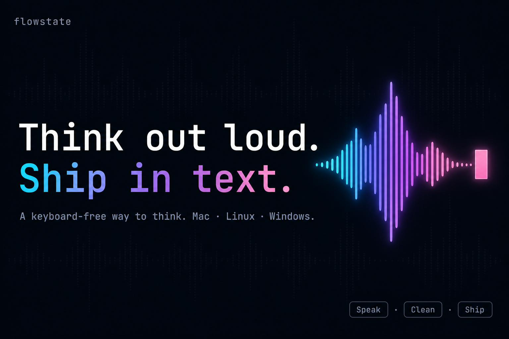
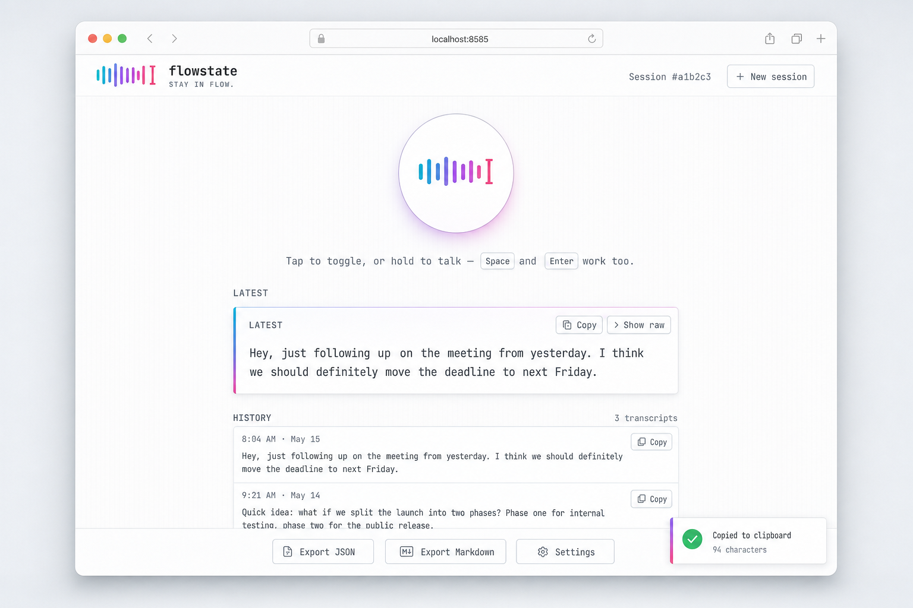
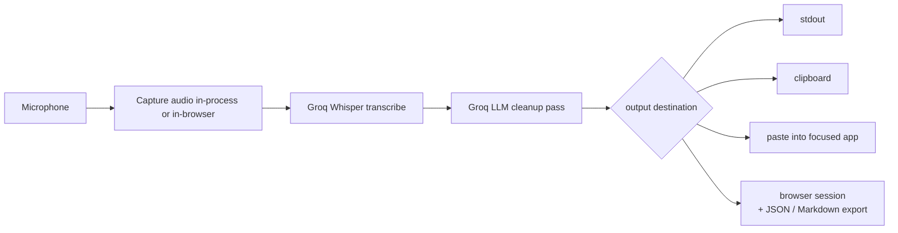
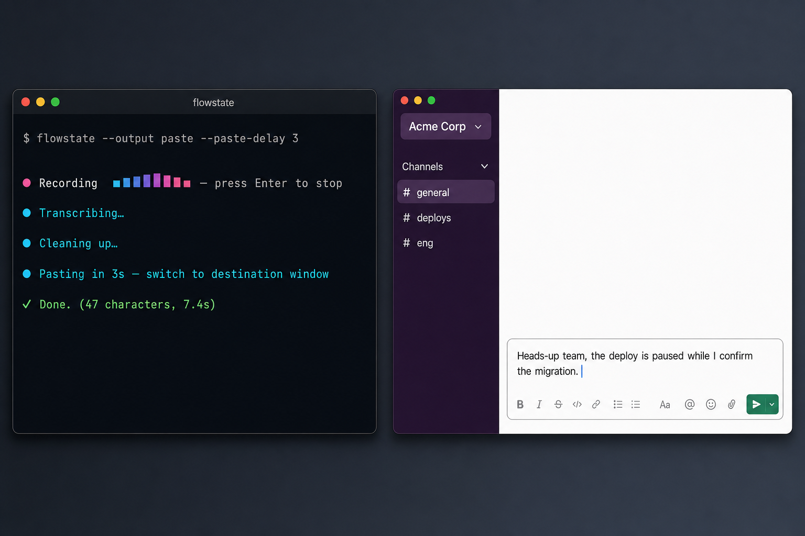
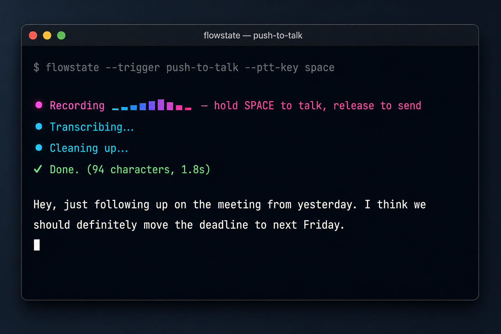

<div align="center">



<h1>flowstate</h1>

<p><strong>Think out loud. Ship in text.</strong> &nbsp;·&nbsp; <em>Stay in flow.</em></p>

<p>A keyboard-free way to think. flowstate captures your voice, cleans it with an LLM,<br/>
and drops perfect text into any app — from your terminal <em>or your browser</em>, on Mac, Linux, and Windows.</p>

<p>
  <a href="https://github.com/mazen160/flowstate/actions/workflows/ci.yml"></a>
  <a href="https://github.com/mazen160/flowstate/releases"></a>
  <a href="https://golang.org/dl/"></a>
  <a href="LICENSE"></a>
  
  <a href="https://console.groq.com"></a>
</p>

<p>
  <a href="#install">Install</a> ·
  <a href="#quickstart">Quickstart</a> ·
  <a href="#two-interfaces-one-binary">Two interfaces</a> ·
  <a href="#recipes">Recipes</a> ·
  <a href="#how-it-compares">Compare</a> ·
  <a href="https://github.com/mazen160/flowstate/discussions">Discussions</a>
</p>

</div>

---

## See it think

<div align="center">
  
  <br/>
  <sub>If your viewer doesn't animate SVGs, see <a href="assets/demo.png"><code>demo.png</code></a>.</sub>
</div>

A real session, end-to-end:

```text
$ flowstate
● Recording ▁▂▄█▆▃▁ — press Enter to stop
[you speak: "hey um so just wanted to follow up on the meating from yesterday i
 think we should definately move the deadline to next friday"]
[Enter]
● Transcribing…
● Cleaning up…
✓ Done. (94 characters, 1.8s)

Hey, just following up on the meeting from yesterday. I think we should
definitely move the deadline to next Friday.
```

The cleaned text lands on stdout AND your clipboard. Status (the `●` / `✓` lines) goes to stderr — pipe-safe by default.

## Two interfaces, one binary

The same `flowstate` binary speaks two surfaces. Same Groq pipeline, same config file, same brand:

<table>
<tr>
<td width="50%" valign="top">

### CLI — `flowstate`
A terminal-native, pipe-friendly dictation tool. Press Enter to stop, or hold a key to push-to-talk. Output to stdout, clipboard, paste-into-focused-app, or any combination. Built for `flowstate | jq`, `flowstate | gh issue create`, `tee -a journal.md`.

</td>
<td width="50%" valign="top">

### Web UI — `flowstate web`
A local browser app for when you want a button to click instead of a key to press. Live waveform meter, toast notifications, tap-to-toggle or hold-to-talk. Per-browser session history (never persisted server-side), exports to JSON or Markdown. One command to start.

</td>
</tr>
</table>

<div align="center">
  
</div>

Pick whichever fits the moment. They share the config file, the prompts, and the API key — so anything you tune for one applies to the other.

## Why flowstate

<table>
<tr>
<td width="33%" valign="top">

### Speak.
Press Enter, hold a key, or click a button — whichever interface you're in. A live mic meter shows you it's listening. No menu-bar app to install, no daemon to manage.

</td>
<td width="33%" valign="top">

### Clean.
Filler words gone. Punctuation right. Self-corrections honored. Domain spellings preserved. Powered by Groq's Whisper for transcription and an LLM cleanup pass that knows the difference between prose and code.

</td>
<td width="33%" valign="top">

### Ship.
Print to stdout. Copy to clipboard. Paste into the focused app. Or fire up the web UI and click Copy. flowstate is a CLI citizen *and* a tab in your browser, not an island.

</td>
</tr>
</table>



The pipeline is shared between the CLI (`flowstate`) and the web server (`flowstate web`). The only thing that differs is what hands the cleaned text back to you.

## Status

**v1.0.0**, released and tagged. Tested on macOS, Linux, and Windows; the audio capture, paste-as-keystrokes, and web UI paths have been hand-exercised across the three platforms. Bug reports, recipes, and PRs welcome — see [Contributing](#contributing).

## Install

The fastest path on every platform — one command, one binary, both interfaces:

```sh
go install github.com/mazin-ahmed/flowstate/cmd/flowstate@latest
```

That gives you `flowstate` (CLI) and `flowstate web` (the local browser UI) in the same executable.

flowstate is cgo-enabled (audio capture and keyboard hooks need it), so you'll need a working C toolchain. Pick your OS for the exact prerequisites:

<details>
<summary><b>macOS</b></summary>

Install Xcode command-line tools, then `go install`:

```sh
xcode-select --install
go install github.com/mazin-ahmed/flowstate/cmd/flowstate@latest
```

The first time you use `paste` or `push-to-talk`, the OS will prompt you to add Accessibility permission for the terminal application running flowstate (Terminal, iTerm2, etc.) under **System Settings → Privacy & Security → Accessibility**.

If you downloaded a release archive instead of building, macOS Gatekeeper will quarantine the binary. Strip the attribute once:

```sh
xattr -d com.apple.quarantine ./flowstate
```

For the web UI, the browser will ask for microphone permission the first time you press Record. No system-level permission needed.

</details>

<details>
<summary><b>Linux</b></summary>

On Debian/Ubuntu-based distributions:

```sh
sudo apt-get update
sudo apt-get install -y \
    libasound2-dev \
    libx11-dev libxkbcommon-dev libxtst-dev libxinerama-dev libxrandr-dev \
    pulseaudio-utils alsa-utils
go install github.com/mazin-ahmed/flowstate/cmd/flowstate@latest
```

For `output_mode = paste` on Wayland, install `wtype`. On X11, `xdotool` is the fallback.

</details>

<details>
<summary><b>Windows</b></summary>

Install Go (which ships with a working C toolchain), then:

```powershell
go install github.com/mazin-ahmed/flowstate/cmd/flowstate@latest
```

Audio capture (WASAPI), `mute_while_recording`, paste (`SendInput`), and push-to-talk all work without extra permissions.

</details>

<details>
<summary><b>From a release archive</b></summary>

Download the matching archive from [Releases](https://github.com/mazen160/flowstate/releases), extract, and put the binary on your `$PATH`:

```sh
# Linux / macOS
tar -xzf flowstate_vX.Y.Z_<os>_<arch>.tar.gz
mv flowstate /usr/local/bin/
```

```powershell
# Windows
Expand-Archive flowstate_vX.Y.Z_windows_amd64.zip
```

Each release archive ships with a per-platform SHA-256 checksum file (`.sha256`) for verification.

</details>

<details>
<summary><b>Build from source (any platform)</b></summary>

Works before the first tag lands on the module proxy, or when you want to track `main` directly. The system-level prerequisites (Xcode CLT on macOS, the apt packages on Linux, MSVC/mingw on Windows) are the same as for `go install` above.

```sh
git clone https://github.com/mazen160/flowstate.git
cd flowstate
make build              # produces ./flowstate
./flowstate version

# Or install straight onto your PATH:
make install            # → $(go env GOPATH)/bin/flowstate
```

If `make build` isn't available, the equivalent raw command is:

```sh
go build -o flowstate ./cmd/flowstate
```

`make build` is preferred because it bakes the current `git describe --tags` value into the binary so `flowstate version` reports something meaningful. A pure `go build` falls back to the in-tree default version string.

</details>

## Quickstart

```sh
flowstate config init                 # write default config
export GROQ_API_KEY=gsk_...           # get one from https://console.groq.com
```

Then pick your interface:

```sh
flowstate                             # CLI: speak, then press Enter
flowstate web                         # web UI: opens at http://127.0.0.1:8585
```

That's the whole loop. The cleaned text lands wherever you've configured (stdout + clipboard by default for CLI; in the page + your clipboard for web).

## The web UI in a minute

Run `flowstate web` and open `http://127.0.0.1:8585`. Here's what you get:

- **Tap to toggle, or hold to talk.** A short tap (or `Space` / `Enter`) starts recording, another short tap stops. Press-and-hold (mouse, touch, *or* the Space key) for at least 320 ms to switch into release-to-send mode for that one recording.
- **Live waveform meter.** While you speak, the brand mark on the record button is replaced by 7 gradient bars driven by your real audio levels — same vocabulary as the CLI's mic meter.
- **Latest result + history.** Every recording shows up as a card with Copy and Show-raw buttons. Older transcripts stack into a per-session history list with their own Copy buttons.
- **Toasts for everything.** Copies (manual *and* auto), settings saves, session switches, and local-data clears all pop a small bottom-right confirmation so you never wonder if a click landed.
- **Sessions.** Hit *New session* in the top bar to start a fresh stream of transcripts. The session select in Settings switches between past sessions; *Export JSON* / *Export Markdown* dump the current one to a file.
- **Auto-copy** *(opt-in)*. Toggle in Settings to copy each cleaned transcript to the clipboard automatically the moment it finishes.
- **Privacy by design.** Sessions, transcripts, and the optional API token live in your browser's `localStorage` — the server never persists them. The audio bytes are streamed straight to Groq and never written to disk on the server side. *Clear local data* in Settings wipes everything in this browser.

Common knobs:

```sh
flowstate web                                          # bind 127.0.0.1:8585
flowstate web --web-port 9000                          # different port
flowstate web --web-interface-listen 0.0.0.0           # LAN access (see warning)
flowstate web --web-token "$(openssl rand -hex 16)"    # require Bearer token
FLOWSTATE_WEB_TOKEN=secret flowstate web               # token via env
flowstate web --config /etc/flowstate.toml             # alternate config
```

If you bind to a non-loopback interface (anything but `127.0.0.1`, `::1`, or `localhost`) without a token, flowstate prints a loud `⚠ WARNING` on startup so you know any device on your network can hit the API. Either keep the bind on loopback or set `--web-token` (or `FLOWSTATE_WEB_TOKEN`).

<details>
<summary><b>Web UI keyboard shortcuts</b></summary>

| Action | Shortcut | Notes |
|---|---|---|
| Toggle recording | Tap rec button · `Space` · `Enter` | Either key, anywhere on the page (except inside an input). |
| Push-to-talk | Hold rec button · hold `Space` · hold `Enter` | Hold for ≥320 ms; release sends. |
| Show raw transcript | Click `› Show raw` | On the result card or any history item. |
| Copy cleaned text | Click `⧉ Copy` | Fires a toast confirming the character count. |
| Open / close settings | Click `⚙ Settings` | Bottom dock. |
| New session | Click `+ New session` | Top right. |

</details>

<details>
<summary><b>JSON API (under <code>/api/*</code>)</b></summary>

The web UI is a thin client over a minimal JSON API. You can call these directly from `curl`, scripts, or your own tooling:

| Method | Path | Purpose |
|---|---|---|
| `GET`  | `/api/health`     | Liveness probe. Returns `{"ok": true, "version": "..."}`. |
| `GET`  | `/api/info`       | `{"version": "...", "auth_required": true|false}`. The frontend reads this once on load to decide whether to show the token field. |
| `POST` | `/api/transcribe` | Multipart upload. One field: `audio` (the recorded blob, any browser-supported codec). Returns `{"raw": "...", "cleaned": "...", "duration_ms": 1234}`. |

Auth is a single Bearer token. When `--web-token` (or `FLOWSTATE_WEB_TOKEN`) is set, `/api/transcribe` requires `Authorization: Bearer <token>`. `/api/health` and `/api/info` are intentionally **always public** — the frontend reads `/api/info` to discover whether auth is required, and `/health` is a probe endpoint kept reachable for liveness checks.

```sh
# Health check (always works, no token)
curl http://127.0.0.1:8585/api/health

# Discover auth state (always works, no token)
curl http://127.0.0.1:8585/api/info
# {"version": "1.0.0", "auth_required": true}

# Transcribe a clip
curl -X POST http://127.0.0.1:8585/api/transcribe \
     -H "Authorization: Bearer $FLOWSTATE_WEB_TOKEN" \
     -F "audio=@clip.webm"
```

`POST /api/transcribe` is rate-limited to **30 requests per minute per source IP** — far above interactive use, low enough to bound runaway Groq spend if the API is exposed on a LAN. The response carries `Retry-After: 60` when the limit fires.

Every non-success response shares the shape `{"error": "<friendly message>"}`. Status codes for `/api/transcribe`:

| Code | Meaning |
|---|---|
| `200` | Success. Both `raw` and `cleaned` may be empty (silent / hallucination filter). |
| `400` | Request was not multipart, or the multipart parse failed. |
| `401` | Token required but missing or wrong. |
| `405` | Non-`POST` to `/api/transcribe`. |
| `413` | Upload exceeded 25 MiB (Groq's transcription cap). |
| `415` | `audio` field missing from the multipart body. |
| `429` | Too many requests from this source IP within the last 60 seconds. Honor `Retry-After`. |
| `500` | Groq returned an error. The body's `error` field carries the friendly message when it's a documented upstream failure (auth, quota, payload size); for transport-level errors the body is the generic `"upstream request failed; check the server log for details"` and the full error is logged to the server's stderr. |

</details>

## Recipes

### Send a Slack message (CLI)

```sh
flowstate --output paste --paste-delay 3
```

Speak, press Enter (or wait for max-time), then switch to Slack within 3 seconds — flowstate types the cleaned text where your cursor is.

<div align="center">
  
</div>

### Push-to-talk (CLI)

Edit the config: `trigger = "push-to-talk"`, `ptt_key = "space"`. Then run `flowstate` — recording starts when you hold space and stops when you release. Requires Accessibility permission on macOS.

<div align="center">
  
</div>

### Dictate from any browser tab (Web UI)

```sh
flowstate web
```

Open `http://127.0.0.1:8585` in any tab — Chrome, Safari, Firefox, Arc. Tap the button (or hold Space) to dictate. Hit *Auto-copy* in Settings if you'd like the cleaned text to land on your clipboard automatically the moment each recording finishes.

### Save a transcript to a file (CLI)

```sh
flowstate --output stdout > note.md
```

Stdout is just the text. Status lines (Recording…/Done.) go to stderr.

### Export an entire session (Web UI)

In the bottom dock: *Export JSON* downloads a structured dump of every transcript in the current session; *Export Markdown* gives you a formatted, scannable version with `<details>`-collapsed raw transcripts. Both files include cleaned text, raw text, and timestamps.

### One-shot, no keypress (CLI)

```sh
flowstate --max-time 10
```

Auto-stops after 10 seconds. Same pipeline; exits 0.

### Translate as you dictate

Set `output_language = "French"` in `~/.config/flowstate/config.toml`, then run `flowstate` (or `flowstate web`) and speak in English. The cleanup pass translates the result. Works the same in both interfaces — they read the same config.

### Pipe into a tool (CLI)

```sh
flowstate --output stdout | gh issue create --title "voice note" --body -
flowstate --output stdout | tee -a journal.md
flowstate --output stdout | mail -s "voice memo" you@example.com
```

### Pick a non-default microphone (CLI)

```sh
flowstate devices            # list inputs
flowstate --device '4275696c74496e4d6963726f70686f6e65446576696365'
```

In the web UI, the microphone is whichever your browser's standard "this site wants to use your microphone" picker selected — change it from the browser's site-permissions UI.

### Dictate from another machine on your LAN (Web UI)

```sh
flowstate web \
  --web-interface-listen 0.0.0.0 \
  --web-token "$(openssl rand -hex 16)"
```

flowstate prints the listening URL on stderr; visit it from your laptop, your iPad, your phone. **Always set `--web-token` when binding to a non-loopback interface** — the warning on startup isn't a suggestion.

### Disable colors / quiet mode (CLI)

```sh
flowstate --no-color           # plain stderr, no ANSI
NO_COLOR=1 flowstate           # same, shell-wide
flowstate 2>/dev/null          # suppress all status; transcript only
```

## How it compares

|                          | **flowstate**                | Wispr Flow              | Superwhisper          | whisper.cpp                |
|--------------------------|------------------------------|--------------------------|-----------------------|----------------------------|
| Mac / Linux / Windows    | Yes                          | Mac / Win / mobile       | Mac only              | Mac / Linux / Windows      |
| Terminal-native CLI      | Yes — pipe-friendly          | No (menu-bar app)        | No (menu-bar app)     | Yes — but lower-level      |
| Local web UI             | Yes — `flowstate web`        | No                       | No                    | No                         |
| LLM cleanup pass         | Yes — Groq                   | Yes — proprietary        | Yes — proprietary     | No (raw transcription)     |
| BYO API key              | Yes — Groq                   | Subscription             | One-time license      | n/a (local)                |
| Network required         | Yes — Groq API               | Yes                      | No (local)            | No (local)                 |
| Cost                     | Free + Groq API usage        | Subscription             | One-time license      | Free                       |
| Best for                 | Devs who live in the terminal *and* the browser | Knowledge workers | Privacy-first dictators | Hackers and researchers |

flowstate is the one that's all of: cross-platform, terminal-native, **with a self-hosted browser UI**, LLM-cleaned, BYO key, and free. Pick whichever matches how you work.

## Configuration

flowstate's CLI and web UI both read the same TOML config and the same `GROQ_API_KEY` environment variable. Tune one place; both interfaces follow.

<details>
<summary><b>Where the config lives</b></summary>

Configuration lives in TOML at the path printed by `flowstate config path`.
Resolution order: `--config <path>` > `$FLOWSTATE_CONFIG` > the platform default
(`~/.config/flowstate/config.toml` on macOS/Linux or `%APPDATA%\flowstate\config.toml`
on Windows).

The Groq API key is **not** a config field. It is read from the `GROQ_API_KEY`
environment variable (or `GROQ_API_TOKEN` as a fallback) at runtime. Any
subcommand that calls Groq — `flowstate` *or* `flowstate web` — will fail with
a friendly message naming both env vars if neither is set.

</details>

<details>
<summary><b>All flags (record mode)</b></summary>

| Flag | Default | Effect |
|---|---|---|
| `--config <path>` | platform default | Override config file path. |
| `--prompt <name>` | `default` | Switch active cleanup prompt (`default` / `command` / `literal`). |
| `--output <list>` | `stdout,clipboard` | Comma list of `stdout` / `clipboard` / `paste`, or `all`. |
| `--no-mute` | (mute on) | Disable mute_while_recording for this run. |
| `--device <uid>` | system default | Pick a specific microphone. List via `flowstate devices`. |
| `--trigger <mode>` | `enter` | `enter` or `push-to-talk`. |
| `--ptt-key <name>` | `space` | Key held in push-to-talk mode. |
| `--model <name>` | `openai/gpt-oss-20b` | Override cleanup model. |
| `--no-color` | (auto) | Disable ANSI colors on stderr. |
| `--max-time <secs>` | `0` | Auto-stop recording after N seconds and process. |
| `--paste-delay <secs>` | `0` | Wait N seconds between clipboard seed and paste keystroke. |

All flags override the matching config field for one invocation only. Unset flags leave the on-disk config untouched.

</details>

<details>
<summary><b>All flags (web mode)</b></summary>

| Flag | Default | Effect |
|---|---|---|
| `--config <path>` | platform default | Override config file path (same resolution as record mode). |
| `--web-interface-listen <host>` | `127.0.0.1` | Interface to bind. Use `0.0.0.0` for LAN; expect a non-loopback warning. |
| `--web-port <port>` | `8585` | TCP port to listen on. |
| `--web-token <token>` | `""` | Optional Bearer token for `/api/*`. Falls back to `FLOWSTATE_WEB_TOKEN`. Empty means auth-disabled. |

The web subcommand reads the rest of its behavior (transcription model, cleanup model, language, custom vocabulary, output language, prompts) from the same config file the CLI uses.

</details>

<details>
<summary><b>All config fields</b></summary>

| Field                    | Default                                    | Meaning                                                                              |
| ------------------------ | ------------------------------------------ | ------------------------------------------------------------------------------------ |
| `trigger`                | `"enter"`                                  | How recording stops (CLI only): `enter` (press Enter) or `push-to-talk` (hold a key). |
| `ptt_key`                | `"space"`                                  | Key held in push-to-talk mode. Ignored when `trigger = "enter"`.                     |
| `base_url`               | `"https://api.groq.com/openai/v1"`         | Provider root. Override only for a self-hosted OpenAI-compatible proxy.              |
| `transcription_model`    | `"whisper-large-v3"`                       | Whisper model id passed to `/audio/transcriptions`.                                  |
| `cleanup_model`          | `"openai/gpt-oss-20b"`                     | LLM model id passed to `/chat/completions` for cleanup.                              |
| `cleanup_fallback_model` | `"meta-llama/llama-4-scout-17b-16e-instruct"` | Retried on HTTP 429 or empty primary response. Set equal to `cleanup_model` (or empty) to disable. |
| `language`               | `"en"`                                     | ISO-639-1 language hint. Set `""` to auto-detect, or `"fr"`/`"es"`/`"de"`/etc.       |
| `output_language`        | `""`                                       | Translation target for the cleanup pass. Empty = same as spoken. Non-empty adds an "Output ONLY in `<lang>`" directive to the cleanup system prompt. |
| `input_device`           | `""`                                       | Microphone UID or name (CLI only). Empty = system default. List with `flowstate devices`. |
| `mute_while_recording`   | `true`                                     | Mutes system audio output during the recording so playback doesn't bleed in (CLI only). |
| `output_mode`            | `"stdout,clipboard"`                       | Comma list of `stdout`, `clipboard`, `paste`, or the literal `"all"` (CLI only).     |
| `preserve_clipboard_after_paste` | `true`                              | When `paste` is enabled, snapshot the current clipboard before pasting and restore it ~500ms later, unless you copied something else in the meantime. |
| `active_prompt`          | `"default"`                                | Which key under `[prompts]` to use as the system prompt for cleanup.                 |
| `custom_vocabulary`      | `""`                                       | Comma/newline/semicolon-separated terms preserved as high-priority spellings during cleanup. Multiline TOML strings are supported. |
| `colors`                 | `"auto"`                                   | Status-line colors (CLI only): `"auto"` (TTY-detect), `"always"` (force on), `"never"` (force off). `--no-color` and `NO_COLOR=1` also disable. |
| `max_time_seconds`       | `0`                                        | Auto-stop recording after N seconds and process normally (CLI only). `0` disables. |
| `paste_delay_seconds`    | `0`                                        | When `paste` is enabled, wait N seconds between writing the clipboard and firing the paste keystroke. |
| `[prompts]`              | three embedded prompts                     | Table of named cleanup prompts. See **Prompts** below.                               |

Fields marked *(CLI only)* are ignored by `flowstate web` — the web UI handles output in the browser (clipboard + page + history), the recording trigger is the page itself, and the device picker is the browser's.

</details>

<details>
<summary><b>Prompts (default / command / literal)</b></summary>

`[prompts]` is a table of named system prompts. flowstate ships three by default:

- **`default`** — full FreeFlow-style cleanup. Removes filler words, fixes spelling and punctuation, preserves the speaker's intent, and is aware of developer syntax (code blocks, command names) so technical dictation doesn't get auto-corrected to gibberish.
- **`command`** — transform a highlighted piece of text per a spoken instruction (e.g. "make this shorter"). Reserved for a future edit-mode subcommand; currently ignored unless explicitly selected.
- **`literal`** — minimal cleanup, no context-awareness. Use this if the default prompt is rewriting more than you want.

Switch prompts per-run with `--prompt <name>` (CLI), or change `active_prompt` in the config to make it sticky for both the CLI and the web UI. Prompt bodies are embedded into the default config at `flowstate config init` time, so you can edit them in place; re-init won't clobber your changes (use `--force` to overwrite).

</details>

<details>
<summary><b>Trigger modes (CLI)</b></summary>

### `enter` (default)

Capture starts as soon as `flowstate` is invoked and stops when you press Enter. Works on every host without extra permissions.

### `push-to-talk`

Capture starts when you press and hold `ptt_key`, and stops when you release it. The transcription + cleanup pipeline runs on release.

PTT uses a global keyboard hook (so the key works regardless of which window has focus), which requires extra permissions:

- **macOS** — Accessibility permission for the terminal application, granted in **System Settings → Privacy & Security → Accessibility**. The first attempted use will prompt you.
- **Linux** — usually works out of the box on X11; Wayland support depends on the compositor.
- **Windows** — works out of the box.

The web UI's tap-vs-hold gesture (described above) replaces this for browser sessions and needs no extra permissions.

</details>

<details>
<summary><b>Output modes (stdout / clipboard / paste / all) — CLI</b></summary>

`output_mode` is a comma-separated list of destinations:

- `stdout` — print the cleaned text to standard output, followed by a newline. Status (`Done. (N characters)`) goes to stderr, so stdout stays pipeable.
- `clipboard` — copy the cleaned text to the system clipboard.
- `paste` — simulate `Cmd+V` (macOS) or `Ctrl+V` (Linux/Windows) into the currently focused application.

The literal value `all` is shorthand for `stdout,clipboard,paste`. Order doesn't matter; flowstate always writes to all selected destinations.

(The web UI doesn't use `output_mode` — the cleaned text is rendered into the page and, if the *Auto-copy* setting is on, pushed to your clipboard via the browser's clipboard API.)

</details>

<details>
<summary><b>Status output and colors (CLI)</b></summary>

While a recording is in flight, flowstate prints staged status lines to **stderr**:

- `● Recording — press Enter to stop` with a small live audio-level meter while you speak.
- `● Transcribing…` once the upload starts.
- `● Cleaning up…` while the LLM rewrite runs.
- `✓ Done. (N characters, 2.3s)` at the end.

Errors and soft warnings (mute failure, "no speech detected", config typos) also go to stderr, prefixed with `✗` or `⚠`. **Nothing other than the cleaned transcript is ever written to stdout**, so `flowstate | jq` and similar pipelines stay clean.

Disable colors with `--no-color`, `NO_COLOR=1`, or `colors = "never"` in the config. Force on with `colors = "always"`. Default is `"auto"` (TTY-detect).

The web UI replaces these with on-page state (waveform meter, ring pulse, status label) and toast notifications for completed actions.

</details>

<details>
<summary><b>All subcommands</b></summary>

- `flowstate` — record (CLI). The default command.
- `flowstate web [flags]` — start the local web UI + JSON API. Default bind: `127.0.0.1:8585`.
- `flowstate version` — print the build identifier and Go runtime version.
- `flowstate config init [--force] [--config <path>]` — write the default config to the resolved path. `--force` overwrites an existing file.
- `flowstate config path [--config <path>]` — print the resolved config path to stdout.
- `flowstate devices` — list input devices as `<UID>\t<Name>`. Useful for filling in `input_device`. Exits 1 with "no input devices found" on a headless host.
- `flowstate --help` / `-h` / `help` — print the short help text.

</details>

<details>
<summary><b>Per-platform prerequisites (full table)</b></summary>

| Feature                | macOS                              | Linux                                   | Windows                |
| ---------------------- | ---------------------------------- | --------------------------------------- | ---------------------- |
| Audio capture (CLI)    | built-in                           | built-in (PulseAudio / PipeWire)        | built-in (WASAPI)      |
| Audio capture (web)    | browser mic permission             | browser mic permission                  | browser mic permission |
| `mute_while_recording` | `osascript` (built-in)             | `pactl` (PulseAudio) or `amixer` (ALSA) | built-in (Core Audio)  |
| `output_mode = paste`  | Accessibility permission for the terminal running flowstate | `wtype` (Wayland) or `xdotool` (X11)    | built-in (`SendInput`) |
| Push-to-talk (CLI)     | Accessibility permission           | (X11/Wayland keyboard hook libs)        | built-in               |
| Push-to-talk (web)     | none — browser handles it          | none                                    | none                   |

</details>

## Troubleshooting

<details>
<summary><b>Common errors and fixes</b></summary>

**`Invalid API key for api.groq.com.`** — your Groq key is unset, expired, or revoked. Generate a new one at [console.groq.com](https://console.groq.com) and re-export it: `export GROQ_API_KEY=gsk_...`.

**`Groq API key not found. Set GROQ_API_KEY (preferred) or GROQ_API_TOKEN in your environment.`** — flowstate looked for both env vars and found neither set. Export `GROQ_API_KEY` in the shell you launch flowstate from (add the line to `~/.zshrc` or `~/.bashrc` so it persists).

**`no input devices found` on `flowstate devices`** — the OS has no microphones registered. On macOS, check **System Settings → Privacy & Security → Microphone** and grant the terminal app permission. On Linux, verify `pactl list short sources` shows at least one source.

**Paste doesn't paste anything on macOS** — your terminal hasn't been granted Accessibility permission. Toggle it off and back on under **System Settings → Privacy & Security → Accessibility**, then re-run flowstate. The permission applies to the terminal application, not the flowstate binary itself.

**`Audio too large (HTTP 413). Try a shorter recording.`** — Groq's transcription endpoint caps uploads at 25 MB. At PCM16 mono 16 kHz that's about 13 minutes of audio. Stop and restart for long-form dictation. The web UI surfaces the same limit on `/api/transcribe`.

**`Rate limited (HTTP 429). Wait a moment and retry.`** — Groq's free tier has rate limits. flowstate automatically retries the cleanup pass with `cleanup_fallback_model`, but the transcription pass surfaces 429 directly.

</details>

<details>
<summary><b>Web UI specific issues</b></summary>

**`listen tcp 127.0.0.1:8585: bind: address already in use`** — another process owns the port. Either stop it, or pick a different one: `flowstate web --web-port 9000`.

**The browser asks for microphone permission and you blocked it.** Without mic access, the record button can't capture audio. Open your browser's site permissions for `http://127.0.0.1:8585` (or whichever URL you bound to) and re-allow microphone access, then reload the page.

**`⚠ WARNING: binding 0.0.0.0:8585 without --web-token. Any device on the network can use the API without authentication.`** — exactly what it says. Either bind back to `127.0.0.1` (the default), or set `--web-token "..."` (or `FLOWSTATE_WEB_TOKEN=...`) so the API rejects unauthenticated requests with `401`.

**The page loads but `Record` does nothing.** Open your browser's devtools console — most likely the mic permission was denied or the request to `/api/transcribe` returned `401` (token missing/wrong). The web UI surfaces the failure as a toast; the console has the underlying HTTP error.

**Settings changes don't seem to stick.** All web settings (token, session, auto-copy) live in the browser's `localStorage` for the URL you're on. Clearing your browser's site data — or using a different browser/profile — starts fresh. Use *Clear local data* in the Settings sheet to wipe deliberately.

</details>

## Roadmap

What's shipped, and what's intentionally left out:

- ✅ Cross-platform CLI (Mac / Linux / Windows).
- ✅ Local web UI (`flowstate web`) bundled in the same binary.
- ✅ JSON API (`/api/health`, `/api/info`, `/api/transcribe`) with optional Bearer auth.
- ✅ Push-to-talk and press-to-stop triggers — both interfaces.
- ✅ Live mic-meter visualization — both interfaces.
- ✅ stdout / clipboard / paste output (CLI), in any combination.
- ✅ In-page result + history + JSON / Markdown export (web).
- ✅ Translation via the cleanup pass.
- ✅ Custom vocabulary for domain spellings.
- 🟡 Streaming transcription (under design — see [Discussions](https://github.com/mazen160/flowstate/discussions)).
- 🟡 Edit-mode subcommand for "rewrite this highlighted text by voice" (the `command` prompt is shipped, the wiring is queued).
- ❌ Menu bar / system tray native app — flowstate intentionally stays a single binary; the web UI covers the "I want a button to click" use case.
- ❌ Background daemon for the CLI — a CLI invocation is one recording. The web server fills the long-running need.
- ❌ Offline / local transcription — flowstate calls Groq. For local, see [whisper.cpp](https://github.com/ggerganov/whisper.cpp).
- ❌ OS-keychain integration — the Groq API key lives in `GROQ_API_KEY`. Persistence is your shell's job (or [direnv](https://direnv.net/), or a vault).

Want one of the 🟡s sooner? Open an issue or chime in on Discussions.

## Contributing

PRs welcome. See [CONTRIBUTING.md](CONTRIBUTING.md) for the dev environment, build, and test workflow.

If you're using flowstate in your daily workflow, share what you built in [Discussions → Show & Tell](https://github.com/mazen160/flowstate/discussions/categories/show-and-tell). Workflow tips and config snippets help everyone.

## License

MIT — see [LICENSE](LICENSE).

## Credits

Inspired by [FreeFlow](https://github.com/zachlatta/freeflow) (Swift, macOS) by Zach Latta, which provides the wire-level reference for the Groq pipeline, and by [Wispr Flow](https://wisprflow.ai), which set the bar for what voice-driven dictation should feel like.

<div align="center">
  <br/>
  <sub>Built with ☕ and a microphone. <a href="https://github.com/mazen160/flowstate">Star the repo</a> if it earned a spot in your dotfiles.</sub>
</div>
